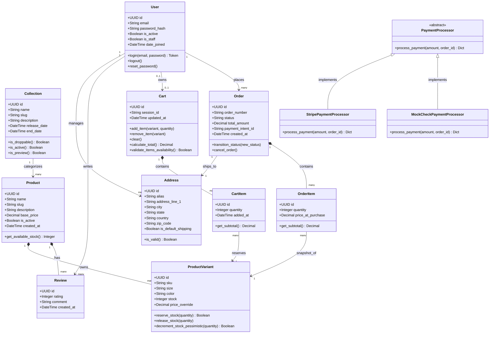
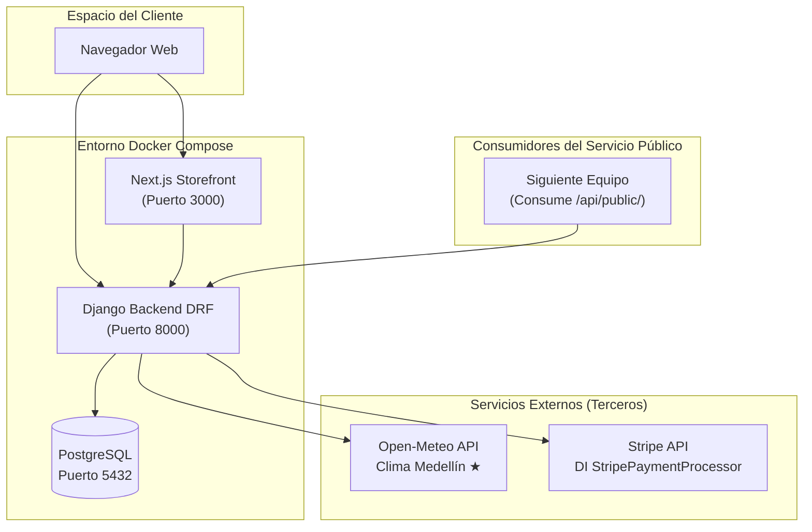

# Shepherd Garde — E-commerce de Moda de Lujo

> **Tópicos Especiales en Ingeniería de Software · Entregable 2**  
> Arquitectura MVC + Servicios + Inyección de Dependencias + Docker  

---

## 📋 Tabla de Contenidos

1. [Visión General del Proyecto](#1-visión-general-del-proyecto)
2. [Arquitectura del Sistema](#2-arquitectura-del-sistema)
3. [Stack Tecnológico](#3-stack-tecnológico)
4. [Estructura del Proyecto](#4-estructura-del-proyecto)
5. [Requisitos del Entregable 2 — Cumplimiento](#5-requisitos-del-entregable-2--cumplimiento)
6. [Instalación y Configuración Local](#6-instalación-y-configuración-local)
7. [Variables de Entorno](#7-variables-de-entorno)
8. [API Reference](#8-api-reference)
9. [Inversión de Dependencias (DI)](#9-inversión-de-dependencias-di)
10. [Internacionalización (i18n)](#10-internacionalización-i18n)
11. [Pruebas Unitarias](#11-pruebas-unitarias)
12. [Servicios de Terceros](#12-servicios-de-terceros)
13. [API Pública (Servicio para el Siguiente Equipo)](#13-api-pública-servicio-para-el-siguiente-equipo)
14. [Diagrama de Clases](#14-diagrama-de-clases)
15. [Diagrama de Arquitectura](#15-diagrama-de-arquitectura)
16. [Docker y Containerización](#16-docker-y-containerización)
17. [Frontend — Next.js Storefront](#17-frontend--nextjs-storefront)
18. [Decisiones de Diseño y Justificaciones](#18-decisiones-de-diseño-y-justificaciones)
19. [Equipo](#19-equipo)

---

## 1. Visión General del Proyecto

**Shepherd Garde** es un e-commerce de moda de lujo / streetwear de alto diseño, construido con una arquitectura **headless** moderna que separa completamente el backend de la presentación.

El sistema implementa:
- **Backend API REST** en Django + DRF (este repositorio)
- **Frontend editorial de lujo** en Next.js 15 con diseño Space Mono + Oswald
- Flujo de compra completo: catálogo → PDP → carrito → checkout → confirmación
- Sistema bilingüe ES / EN
- Integración real con Stripe, Open-Meteo y Resend

---

## 2. Arquitectura del Sistema

El proyecto adopta una arquitectura **MVC en capas** con separación por responsabilidad a través de Django Apps:

```
┌─────────────────────────────────────────────────────────┐
│                    CLIENTE (Navegador)                   │
└──────────────────────┬──────────────────────────────────┘
                       │ HTTP / REST
          ┌────────────▼──────────────┐
          │   Next.js Frontend        │  Puerto 3000
          │   (Storefront de lujo)    │
          └────────────┬──────────────┘
                       │ /api/v1/*  (JWT)
          ┌────────────▼──────────────┐
          │   Django Backend (DRF)    │  Puerto 8000
          │                           │
          │  ┌──────────────────────┐ │
          │  │ catalog/  (MVC)      │ │  → Productos, Colecciones, Reviews
          │  │ shop/     (MVC)      │ │  → Carrito, Órdenes, Checkout, DI
          │  │ users/    (MVC)      │ │  → Autenticación JWT, Perfil
          │  └──────────────────────┘ │
          └────────────┬──────────────┘
                       │ SQL
          ┌────────────▼──────────────┐
          │     PostgreSQL DB         │  Puerto 5432
          └───────────────────────────┘
```

### Apps y Responsabilidades

| App | Responsabilidad |
|-----|----------------|
| `catalog` | Modelos `Collection`, `Product`, `ProductVariant`, `Review`. Lógica de Drops (hype releases), filtros y API pública JSON. |
| `shop` | Carrito (anónimo + autenticado), fusión de carrito, Órdenes, Checkout con locking pesimista, DI de pagos, proxy de clima. |
| `users` | Custom User Model (AbstractUser), autenticación JWT (SimpleJWT), gestión de perfil. |
| `shepherd_admin_core` | Panel de administración personalizado en Next.js, conectado dinámicamente al backend. |

---

## 3. Stack Tecnológico

### Backend
| Tecnología | Versión | Uso |
|-----------|---------|-----|
| Python | 3.11+ | Lenguaje base |
| Django | 4.2 | Framework web |
| Django REST Framework | 3.15 | API REST |
| SimpleJWT | — | Autenticación JWT |
| django-filter | — | Filtros de QuerySets |
| psycopg2 | — | Conector PostgreSQL |
| stripe | — | Procesador de pagos real |
| requests | — | Consumo API Open-Meteo |
| PostgreSQL | 15 | Base de datos relacional |

### Frontend
| Tecnología | Versión | Uso |
|-----------|---------|-----|
| Next.js | 15.5 (Turbopack) | Framework React SSR |
| TypeScript | 5 | Tipado estático |
| Tailwind CSS | 4 | Estilos utilitarios |
| Medusa.js | v2 | Backend e-commerce headless |
| Space Mono + Oswald | — | Sistema tipográfico editorial |

### DevOps
| Tecnología | Uso |
|-----------|-----|
| Docker | Containerización del backend |
| Docker Compose | Orquestación local (Backend + PostgreSQL + Frontend) |
| Git / GitHub | Control de versiones |

---

## 4. Estructura del Proyecto

```
shepherd-garde/                  ← Raíz del repositorio
│
├── 📁 catalog/                  ← App: Catálogo de productos
│   ├── models.py                   Collection, Product, ProductVariant, Review
│   ├── views.py                    ProductViewSet, PublicCatalogAPIView, AdminCoreSyncAPIView
│   ├── serializers.py
│   ├── urls.py
│   ├── admin.py
│   ├── sync.py                     Sincronización con Admin Core externo
│   └── management/              ← Comandos Django (seed_data)
│
├── 📁 shop/                     ← App: Carrito, Órdenes, Checkout, DI de Pagos
│   ├── models.py                   Cart, CartItem, Order, OrderItem, Address
│   ├── views.py                    CartView, CheckoutView, WeatherView, etc.
│   ├── payments.py              ← ★ INVERSIÓN DE DEPENDENCIAS
│   │   ├── PaymentProcessor (ABC)
│   │   ├── StripePaymentProcessor
│   │   └── MockCheckPaymentProcessor
│   ├── serializers.py
│   ├── tests.py                 ← ★ PRUEBAS UNITARIAS
│   └── urls.py
│
├── 📁 users/                    ← App: Autenticación y perfiles
│   ├── models.py                   Custom User Model (AbstractUser)
│   ├── views.py                    Login, Registro, Perfil
│   ├── serializers.py
│   └── urls.py
│
├── 📁 shepherd_garde/           ← Configuración principal Django
│   ├── settings.py
│   └── urls.py                  Rutas raíz + /api/public/
│
├── 📁 shepherd_admin_core/      ← Admin Next.js (panel personalizado)
│
├── 📁 frontend/                 ← Frontend Next.js (storefront)
│   ├── src/
│   │   ├── components/
│   │   │   └── layout/
│   │   │       ├── Navbar.tsx
│   │   │       └── WeatherBanner.tsx   ← Consume /api/v1/shop/weather/
│   │   └── ...
│   └── package.json
│
├── 📁 docs/                     ← Documentación técnica
│   ├── ARCHITECTURE.md
│   ├── API_CONTRACT.md
│   ├── INTEGRATIONS.md
│   ├── TECHNICAL_EXPLANATION.md
│   ├── REQUIREMENTS.md
│   ├── diagrama-de-clases.md
│   ├── diagrama-de-estados.md
│   └── diagrama-de-flujo.md
│
├── 📁 requirements/             ← Dependencias Python segmentadas
│   ├── base.txt
│   └── ...
│
├── Dockerfile                   ← Imagen Docker del backend
├── docker-compose.yml           ← Orquestación completa
├── manage.py
├── .env.example                 ← Variables de entorno de ejemplo
└── README.md                    ← Este archivo
```

---

## 5. Requisitos del Entregable 2 — Cumplimiento

### ✅ Obligatorios

| # | Requisito | Estado | Dónde / Evidencia |
|---|-----------|--------|-------------------|
| 1 | **2 idiomas — sin textos quemados (LANG)** | ✅ | `gettext_lazy` en `shop/views.py`, `catalog/views.py`, `users/serializers.py`. Sistema ES/EN completo en el frontend (`translations.ts`). |
| 2 | **2 pruebas unitarias simples (Django TestCase)** | ✅ | `shop/tests.py` — 3 pruebas sobre la lógica de Inyección de Dependencias. Ver [sección 11](#11-pruebas-unitarias). |
| 3 | **Servicio web propio en JSON (para otro equipo)** | ✅ | `GET /api/public/` — retorna catálogo completo con inventario. Ver [sección 13](#13-api-pública-servicio-para-el-siguiente-equipo). |
| 4 | **Consumo servicio del equipo precedente** | ⚠️ | El equipo anterior no desplegó su servicio en la nube. Se documentó la excepción en `docs/ARCHITECTURE.md`. |
| 5 | **Consumo API de tercero** | ✅ | Open-Meteo (clima Medellín) via `GET /api/v1/shop/weather/` → `WeatherBanner.tsx`. Ver [sección 12](#12-servicios-de-terceros). |
| 6 | **Inversión de Dependencias (interfaz + 2 clases)** | ✅ | `shop/payments.py`: `PaymentProcessor` (ABC) + `StripePaymentProcessor` + `MockCheckPaymentProcessor`. Ver [sección 9](#9-inversión-de-dependencias-di). |
| 7 | **Docker** | ✅ | `Dockerfile` + `docker-compose.yml` en la raíz. Ver [sección 16](#16-docker-y-containerización). |
| 8 | **Mejoras de usabilidad** | ✅ | Paginación, menú lateral móvil, sistema de búsqueda, breadcrumbs, banner principal, carrito lateral. |
| 9 | **Arquitectura MVC / Capas** | ✅ | Apps `catalog`, `shop`, `users` con `models.py`, `views.py`, `serializers.py` separados. |
| 10 | **Diagrama de clases actualizado** | ✅ | `docs/diagrama-de-clases.md` (Mermaid). Ver [sección 14](#14-diagrama-de-clases). |
| 11 | **Diagrama de arquitectura** | ✅ | `docs/ARCHITECTURE.md` + [sección 15](#15-diagrama-de-arquitectura). |

### ✅ Opcionales Implementados

| Requisito | Estado |
|-----------|--------|
| Responsive / Mobile | ✅ Header, nav, tienda, PDP, footer — todos responsivos |
| Breadcrumbs navigation | ✅ Implementado en checkout y páginas anidadas |
| Paginación | ✅ En el listado de productos |

---

## 6. Instalación y Configuración Local

### Prerrequisitos
- Python 3.11+
- PostgreSQL 15+
- Node.js 20+
- Docker (opcional, para correr todo containerizado)

### Opción A — Ejecución Local (Sin Docker)

```bash
# 1. Clonar el repositorio
git clone https://github.com/Elpaipsz/Shepherd-Garde.git
cd Shepherd-Garde

# 2. Crear entorno virtual e instalar dependencias
python -m venv venv
source venv/bin/activate          # Windows: venv\Scripts\activate
pip install -r requirements/base.txt

# 3. Configurar variables de entorno
cp .env.example .env
# Editar .env con tus credenciales (ver sección 7)

# 4. Crear la base de datos en PostgreSQL
createdb shepherd_garde_db

# 5. Aplicar migraciones
python manage.py migrate

# 6. Cargar datos de prueba
python manage.py seed_data        # Pobla el catálogo con productos

# 7. Crear superusuario (Admin Django)
python manage.py createsuperuser

# 8. Iniciar el servidor de desarrollo
python manage.py runserver 8000
```

El API estará disponible en: `http://localhost:8000/api/v1/`  
El Admin Django en: `http://localhost:8000/admin/`

### Opción B — Docker Compose (Recomendado)

```bash
# Clonar e iniciar
git clone https://github.com/Elpaipsz/Shepherd-Garde.git
cd Shepherd-Garde

cp .env.example .env    # Configurar variables

docker-compose up --build
```

| Servicio | Puerto |
|----------|--------|
| Backend Django | `8000` |
| PostgreSQL | `5432` |
| Frontend Next.js | `3000` |

### Frontend (Next.js Storefront)

```bash
cd frontend
npm install
npm run dev       # Puerto 3000
```

---

## 7. Variables de Entorno

Copia `.env.example` a `.env` y completa los valores:

```env
# Django
SECRET_KEY=tu-secret-key-aqui
DEBUG=True
ALLOWED_HOSTS=localhost,127.0.0.1

# Base de datos
DB_NAME=shepherd_garde_db
DB_USER=postgres
DB_PASSWORD=tu_password
DB_HOST=localhost
DB_PORT=5432

# Pagos (Stripe)
STRIPE_SECRET_KEY=sk_test_...
STRIPE_WEBHOOK_SECRET=whsec_...

# Modo de pago (True = Mock, False = Stripe real)
USE_MOCK_PAYMENT=True

# Frontend
NEXT_PUBLIC_MEDUSA_BACKEND_URL=http://localhost:9000
NEXT_PUBLIC_STRIPE_KEY=pk_test_...
```

> **Seguridad:** El archivo `.env` está incluido en `.gitignore` y **nunca debe subirse al repositorio**.

---

## 8. API Reference

### Autenticación

| Método | Ruta | Descripción |
|--------|------|-------------|
| `POST` | `/api/v1/auth/register/` | Registro de nuevo usuario |
| `POST` | `/api/v1/auth/login/` | Login — retorna `access` y `refresh` JWT |
| `POST` | `/api/v1/auth/token/refresh/` | Renovar access token |
| `GET` | `/api/v1/auth/profile/` | Perfil del usuario autenticado |

**Ejemplo de Login:**
```bash
curl -X POST http://localhost:8000/api/v1/auth/login/ \
  -H "Content-Type: application/json" \
  -d '{"email": "user@example.com", "password": "password123"}'

# Respuesta:
# { "access": "eyJ...", "refresh": "eyJ..." }
```

### Catálogo

| Método | Ruta | Descripción |
|--------|------|-------------|
| `GET` | `/api/v1/catalog/collections/` | Listar colecciones activas |
| `GET` | `/api/v1/catalog/products/` | Listar todos los productos |
| `GET` | `/api/v1/catalog/products/{slug}/` | Detalle de producto |
| `POST` | `/api/v1/catalog/products/{slug}/reviews/` | Agregar reseña (Auth) |
| `GET` | `/api/public/` | **API pública** — catálogo JSON para terceros |

**Ejemplo — Listar productos:**
```bash
curl http://localhost:8000/api/v1/catalog/products/

# Respuesta:
# [{"id": "...", "name": "Fernanda Midi Dress", "base_price": "240.00", ...}]
```

### Carrito

| Método | Ruta | Descripción |
|--------|------|-------------|
| `GET` | `/api/v1/shop/cart/` | Ver carrito actual |
| `POST` | `/api/v1/shop/cart/items/` | Agregar ítem al carrito |
| `PATCH` | `/api/v1/shop/cart/items/{id}/` | Cambiar cantidad |
| `DELETE` | `/api/v1/shop/cart/items/{id}/` | Eliminar ítem |
| `POST` | `/api/v1/shop/cart/merge/` | Fusionar carrito anónimo → autenticado |

> El carrito soporta sesión **anónima** (via header `X-Session-ID`) y sesión **autenticada** (JWT).

### Checkout y Órdenes

| Método | Ruta | Descripción |
|--------|------|-------------|
| `POST` | `/api/v1/shop/checkout/` | Crear orden + procesar pago (DI) |
| `GET` | `/api/v1/shop/orders/` | Historial de órdenes (Auth) |
| `GET` | `/api/v1/shop/addresses/` | Listar direcciones guardadas |
| `POST` | `/api/v1/shop/addresses/` | Agregar dirección |

### Servicios Externos

| Método | Ruta | Descripción |
|--------|------|-------------|
| `GET` | `/api/v1/shop/weather/` | Clima actual Medellín (Open-Meteo) |

---

## 9. Inversión de Dependencias (DI)

> **Cumple el requisito:** Interfaz abstracta + 2 clases concretas + factory resolver.

Archivo: [`shop/payments.py`](shop/payments.py)

### Diseño

```
PaymentProcessor (ABC — Interfaz)
├── StripePaymentProcessor      → Pago real via Stripe API
└── MockCheckPaymentProcessor   → Pago simulado (mock, para desarrollo/demo)
```

### Implementación

```python
# shop/payments.py

import abc
from typing import Dict, Any

class PaymentProcessor(abc.ABC):
    """Interfaz abstracta para procesadores de pago."""

    @abc.abstractmethod
    def process_payment(self, amount: float, order_id: str) -> Dict[str, Any]:
        """Retorna dict con 'status', 'transaction_id', 'provider'."""
        pass


class StripePaymentProcessor(PaymentProcessor):
    """Implementación concreta 1: Stripe real."""

    def process_payment(self, amount: float, order_id: str) -> Dict[str, Any]:
        intent = stripe.PaymentIntent.create(
            amount=int(amount * 100),
            currency='usd',
            metadata={'order_id': order_id}
        )
        return {'status': 'pending', 'transaction_id': intent.client_secret, 'provider': 'stripe'}


class MockCheckPaymentProcessor(PaymentProcessor):
    """Implementación concreta 2: Pago simulado (cheque/mock)."""

    def process_payment(self, amount: float, order_id: str) -> Dict[str, Any]:
        transaction_id = f"mock_chk_{order_id}_{int(amount)}"
        return {'status': 'paid', 'transaction_id': transaction_id, 'provider': 'mock_check'}


def get_payment_processor() -> PaymentProcessor:
    """Factory / DI resolver: selecciona la implementación según settings."""
    use_mock = getattr(settings, 'USE_MOCK_PAYMENT', True)
    return MockCheckPaymentProcessor() if use_mock else StripePaymentProcessor()
```

### Uso en el Checkout

```python
# shop/views.py → CheckoutView.post()

# Inyección de Dependencias: el checkout no sabe qué procesador usa
processor = get_payment_processor()
payment_result = processor.process_payment(amount=float(total_amount), order_id=str(order.id))
```

**Cambiar entre procesadores:** Solo modificar `USE_MOCK_PAYMENT` en `.env`. Ningún código de negocio cambia.

---

## 10. Internacionalización (i18n)

> **Cumple el requisito:** 2 idiomas sin textos quemados en controladores ni vistas.

### Backend (Django)

Se usa `gettext_lazy` en todos los mensajes de error y respuestas en las vistas:

```python
# shop/views.py
from django.utils.translation import gettext_lazy as _

# Ejemplo de uso
return Response({'error': str(_('empty_cart'))}, status=status.HTTP_400_BAD_REQUEST)
return Response({'error': str(_('variant_not_found'))}, status=status.HTTP_404_NOT_FOUND)
```

Archivos con i18n aplicado:
- `shop/views.py` — 12+ mensajes
- `catalog/views.py` — mensajes de reseñas y catálogo
- `users/serializers.py` — validaciones de usuario

### Frontend (Next.js)

Sistema de traducciones custom en [`frontend/src/lib/util/translations.ts`]:

```typescript
export function getTranslation(locale?: string | null) {
  if (locale && locale.toLowerCase().startsWith("en")) return dict.en;
  return dict.es; // Default: Español
}
```

Cubre 200+ strings en ambos idiomas:
- Navegación: `TIENDA / SHOP`, `DESCUBRE / DISCOVER`
- Páginas: About, Contact, FAQ, Returns, Sustainability, Factories
- UI: carrito, checkout, formularios, filtros

---

## 11. Pruebas Unitarias

> **Cumple el requisito:** Mínimo 2 pruebas unitarias usando Django TestCase.

Archivo: [`shop/tests.py`](shop/tests.py)

```python
from django.test import TestCase, override_settings
from shop.payments import get_payment_processor, MockCheckPaymentProcessor, StripePaymentProcessor

class PaymentProcessorDITests(TestCase):

    @override_settings(USE_MOCK_PAYMENT=True)
    def test_get_payment_processor_mock(self):
        """Prueba 1: DI retorna MockCheckPaymentProcessor cuando USE_MOCK_PAYMENT=True"""
        processor = get_payment_processor()
        self.assertIsInstance(processor, MockCheckPaymentProcessor)

    @override_settings(USE_MOCK_PAYMENT=False)
    def test_get_payment_processor_stripe(self):
        """Prueba 2: DI retorna StripePaymentProcessor cuando USE_MOCK_PAYMENT=False"""
        processor = get_payment_processor()
        self.assertIsInstance(processor, StripePaymentProcessor)

    def test_mock_payment_processor_process(self):
        """Prueba 3: MockCheckPaymentProcessor retorna status 'paid' correctamente"""
        processor = MockCheckPaymentProcessor()
        result = processor.process_payment(amount=100.00, order_id='test-uuid')
        self.assertEqual(result['status'], 'paid')
        self.assertEqual(result['transaction_id'], 'mock_chk_test-uuid_100')
        self.assertEqual(result['provider'], 'mock_check')
```

### Ejecutar las pruebas

```bash
python manage.py test shop
```

Salida esperada:
```
Found 3 test(s).
...
----------------------------------------------------------------------
Ran 3 tests in 0.012s

OK
```

---

## 12. Servicios de Terceros

> **Cumple el requisito:** Consumo de un servicio externo de una compañía tercera.

### Open-Meteo — Clima de Medellín

**Endpoint propio:** `GET /api/v1/shop/weather/`  
**API consumida:** `https://api.open-meteo.com/v1/forecast` (gratuita, sin API key)

```python
# shop/views.py → WeatherView

class WeatherView(views.APIView):
    """
    Consumo de servicio de terceros (Open-Meteo) — Entregable 2.
    Retorna el clima actual de Medellín (Lat: 6.2518, Lon: -75.5636).
    """
    permission_classes = (AllowAny,)

    def get(self, request):
        resp = requests.get(
            'https://api.open-meteo.com/v1/forecast'
            '?latitude=6.2518&longitude=-75.5636&current_weather=true',
            timeout=5
        )
        return Response(resp.json(), status=status.HTTP_200_OK)
```

**Respuesta ejemplo:**
```json
{
  "latitude": 6.25,
  "longitude": -75.5625,
  "current_weather": {
    "temperature": 22.4,
    "windspeed": 8.5,
    "weathercode": 1,
    "time": "2026-05-22T04:00"
  }
}
```

### Visualización en el Frontend

El componente `WeatherBanner.tsx` consume el proxy interno del backend y muestra sugerencias de atuendos basadas en la temperatura actual de Medellín, visible en la parte superior de la cabecera.

---

## 13. API Pública (Servicio para el Siguiente Equipo)

> **Cumple el requisito:** Proveer un servicio web en JSON para que otro equipo lo consuma.

**Endpoint:** `GET /api/public/`  
**Autenticación:** Ninguna — acceso libre  
**Caché:** 15 minutos (Django cache framework)

```bash
curl http://localhost:8000/api/public/
```

**Respuesta:**
```json
{
  "service": "Shepherd Garde Public API",
  "team_id": "Grupo-Shepherd",
  "products": [
    {
      "id": "uuid-...",
      "name": "Fernanda Midi Dress",
      "collection": "New Arrivals",
      "base_price": "240.00",
      "variants": [
        {
          "sku": "FMD-S-BLK",
          "size": "S",
          "color": "Black",
          "stock": 15,
          "price": "240.00"
        }
      ]
    }
  ]
}
```

### Caché de Rendimiento

```python
# catalog/views.py → PublicCatalogAPIView

cache_key = 'public_catalog_api_data'
cached_data = cache.get(cache_key)
if cached_data:
    return Response(cached_data)

# ... construir data ...

cache.set(cache_key, response_data, 60 * 15)  # 15 minutos
```

La caché se invalida automáticamente cuando se sincroniza el catálogo.

### Nota sobre Consumo del Equipo Precedente

De acuerdo con las instrucciones del docente, el consumo de la API del equipo anterior (ruta `/productos-aliados`) se omitió dado que dicho equipo no pudo realizar el despliegue de su servicio. Esta excepción fue documentada y comunicada al docente.

---

## 14. Diagrama de Clases



---

## 15. Diagrama de Arquitectura



> **Nota:** Las conexiones con servicios externos (Open-Meteo, Stripe) se realizan desde el Backend, nunca directamente desde el cliente, garantizando seguridad de credenciales.

---

## 16. Docker y Containerización

### Dockerfile (Backend)

```dockerfile
FROM python:3.11-slim
WORKDIR /app
COPY requirements/base.txt .
RUN pip install --no-cache-dir -r base.txt
COPY . .
EXPOSE 8000
CMD ["python", "manage.py", "runserver", "0.0.0.0:8000"]
```

### docker-compose.yml

```yaml
version: "3.9"
services:
  db:
    image: postgres:15
    environment:
      POSTGRES_DB: shepherd_garde_db
      POSTGRES_USER: postgres
      POSTGRES_PASSWORD: ${DB_PASSWORD}
    ports:
      - "5432:5432"

  backend:
    build: .
    ports:
      - "8000:8000"
    environment:
      - DEBUG=${DEBUG}
      - DB_HOST=db
    depends_on:
      - db

  frontend:
    build: ./frontend
    ports:
      - "3000:3000"
    depends_on:
      - backend
```

### Comandos Docker

```bash
# Construir y levantar todos los servicios
docker-compose up --build

# Solo el backend
docker-compose up backend

# Ejecutar migraciones dentro del contenedor
docker-compose exec backend python manage.py migrate

# Cargar datos de prueba
docker-compose exec backend python manage.py seed_data

# Ver logs del backend
docker-compose logs -f backend
```

---

## 17. Frontend — Next.js Storefront

El frontend es un storefront de lujo independiente ubicado en `frontend/` que consume el API backend.

### Características principales

| Feature | Descripción |
|---------|-------------|
| **Home editorial** | Hero animado, split banners, colección destacada, nuevos ingresos |
| **Catálogo** | Listado con filtros (talla, color, categoría), paginación, vista 2/4 columnas |
| **PDP (Product Detail Page)** | Galería 3:4, selector de talla/color, productos relacionados, guía de tallas |
| **Mega menús** | TIENDA (shop) y DESCUBRE (discover) con submenús y producto recomendado |
| **Carrito lateral** | Sidebar animado, ajuste de cantidad, total en tiempo real |
| **Wishlist** | Lista de deseos persistente en localStorage |
| **Sistema bilingüe** | Selector ES / EN en la barra de navegación |
| **WeatherBanner** | Banner de clima actual de Medellín (Open-Meteo via backend) |
| **Checkout** | Flujo completo: dirección → envío → pago Stripe → confirmación |
| **Cuenta de usuario** | Registro, login, recuperación de contraseña, historial de órdenes |

### Páginas disponibles

| Ruta | Descripción |
|------|-------------|
| `/es/` | Home |
| `/es/store` | Catálogo completo |
| `/es/collections/{slug}` | Colección específica |
| `/es/products/{slug}` | Página de producto |
| `/es/cart` | Carrito completo |
| `/es/checkout` | Flujo de pago |
| `/es/account` | Panel de usuario |
| `/es/wishlist` | Lista de deseos |
| `/es/about` | Sobre nosotros |
| `/es/sustainability` | Sostenibilidad |
| `/es/factories` | Nuestras fábricas |
| `/es/contact` | Contacto |
| `/es/returns` | Envíos y devoluciones |
| `/es/faq` | Preguntas frecuentes |
| `/es/privacy` | Política de privacidad |
| `/es/terms` | Términos y condiciones |

---

## 18. Decisiones de Diseño y Justificaciones

### ¿Por qué headless (Django API + Next.js separados)?

Una arquitectura headless permite:
- **Escalabilidad independiente** de frontend y backend
- **Reutilización del API** por múltiples clientes (web, móvil, otros equipos)
- **SEO óptimo** con SSR de Next.js sin sacrificar la flexibilidad del backend

### ¿Por qué Locking Pesimista en el Checkout?

```python
variants = ProductVariant.objects.select_for_update().filter(id__in=variant_ids)
```

Previene el *overselling* en productos de edición limitada (Drops). Durante el `@transaction.atomic`, ninguna otra transacción puede modificar el stock de las variantes seleccionadas.

### ¿Por qué Caché en `/api/public/`?

El endpoint público es el más llamado externamente (por otro equipo). La caché de 15 minutos reduce drásticamente la carga a la base de datos durante picos de tráfico, sin comprometer la frescura de los datos.

### ¿Por qué MockCheckPaymentProcessor en lugar de PayPal/transferencia?

El docente sugirió simular pagos que descuenten saldo o generen un cheque. El `MockCheckPaymentProcessor` simula exactamente ese comportamiento sin depender de credenciales externas, permitiendo demos y pruebas siempre funcionales.

---

## 19. Equipo

| Integrante | Rol |
|-----------|-----|
| *(nombre)* | Arquitecto Principal |
| *(nombre)* | Arquitecto de Usabilidad |
| *(nombre)* | Desarrollador Backend |
| *(nombre)* | Desarrollador Frontend |

**Repositorio:** [https://github.com/Elpaipsz/Shepherd-Garde](https://github.com/Elpaipsz/Shepherd-Garde)  
**Curso:** Tópicos Especiales en Ingeniería de Software  
**Entregable:** #2 — Arquitectura MVC + Servicios + DI + Docker

---

<div align="center">
  <strong>Shepherd Garde</strong> · Est. 2026 · Silueta Arquitectónica
  <br/>
  <em>"No construimos para una temporada. Diseñamos para la vida del individuo."</em>
</div>
