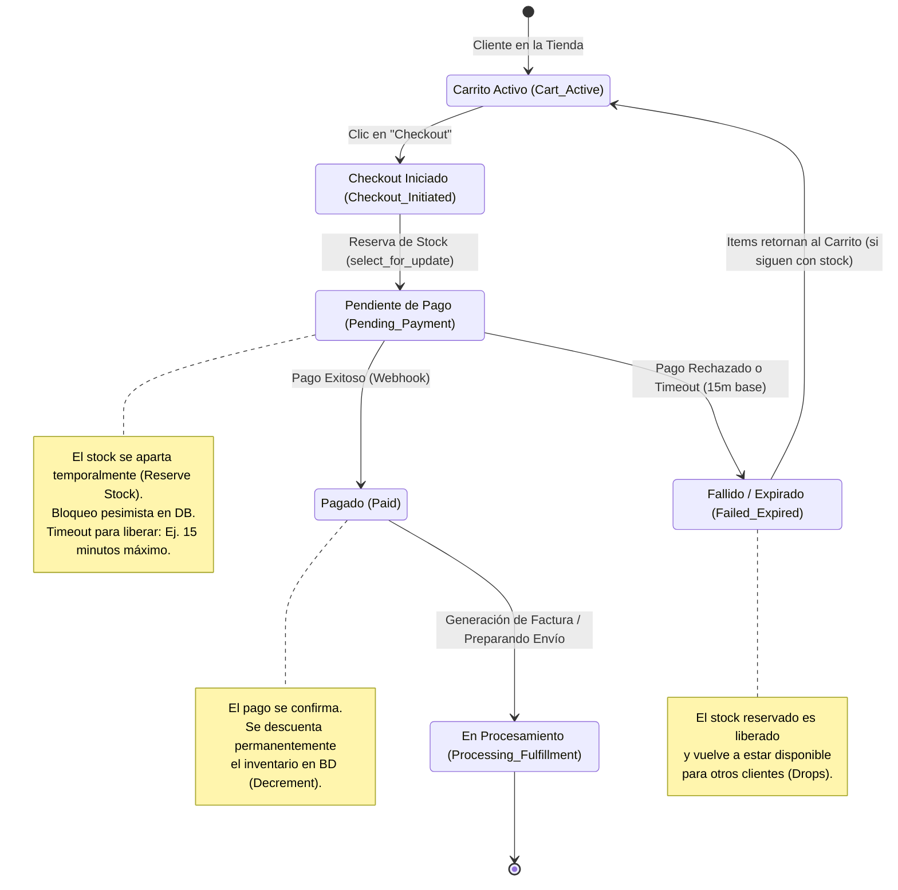

```mermaid
stateDiagram-v2
    direction TB
    [*] --> Cart_Active : Cliente en la Tienda
    
    state "Carrito Activo (Cart_Active)" as Cart_Active
    state "Checkout Iniciado (Checkout_Initiated)" as Checkout_Initiated
    state "Pendiente de Pago (Pending_Payment)" as Pending_Payment
    state "Pagado (Paid)" as Paid
    state "Fallido / Expirado (Failed_Expired)" as Failed_Expired
    state "En Procesamiento (Processing_Fulfillment)" as Processing_Fulfillment

    Cart_Active --> Checkout_Initiated : Clic en "Checkout"
    
    Checkout_Initiated --> Pending_Payment : Reserva de Stock (select_for_update)
    note right of Pending_Payment
        El stock se aparta temporalmente (Reserve Stock).
        Bloqueo pesimista en DB.
        Timeout para liberar: Ej. 15 minutos máximo.
    end note
    
    Pending_Payment --> Paid : Pago Exitoso (Webhook)
    note right of Paid
        El pago se confirma.
        Se descuenta permanentemente
        el inventario en BD (Decrement).
    end note
    
    Pending_Payment --> Failed_Expired : Pago Rechazado o Timeout (15m base)
    note right of Failed_Expired
        El stock reservado es liberado
        y vuelve a estar disponible
        para otros clientes (Drops).
    end note
    
    Paid --> Processing_Fulfillment : Generación de Factura / Preparando Envío
    Failed_Expired --> Cart_Active : Items retornan al Carrito (si siguen con stock)
    
    Processing_Fulfillment --> [*]
```
