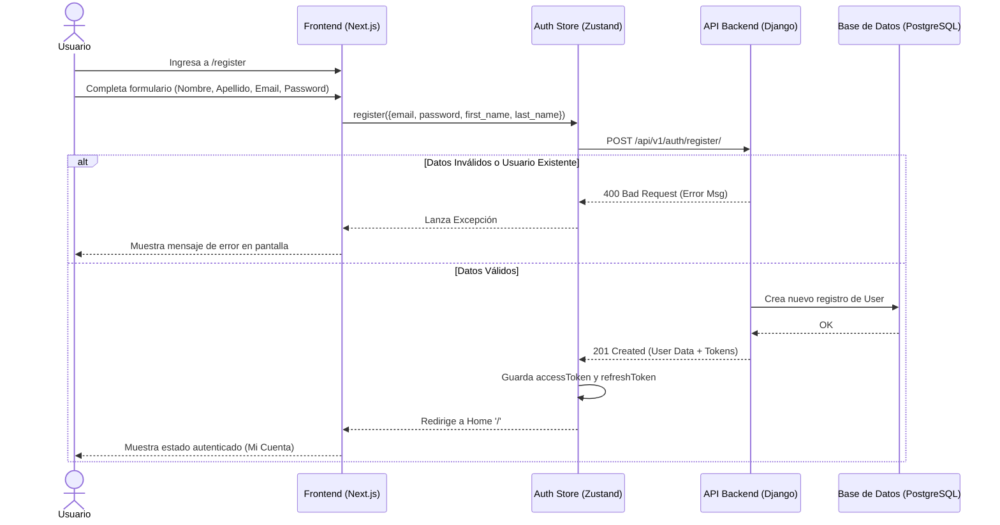
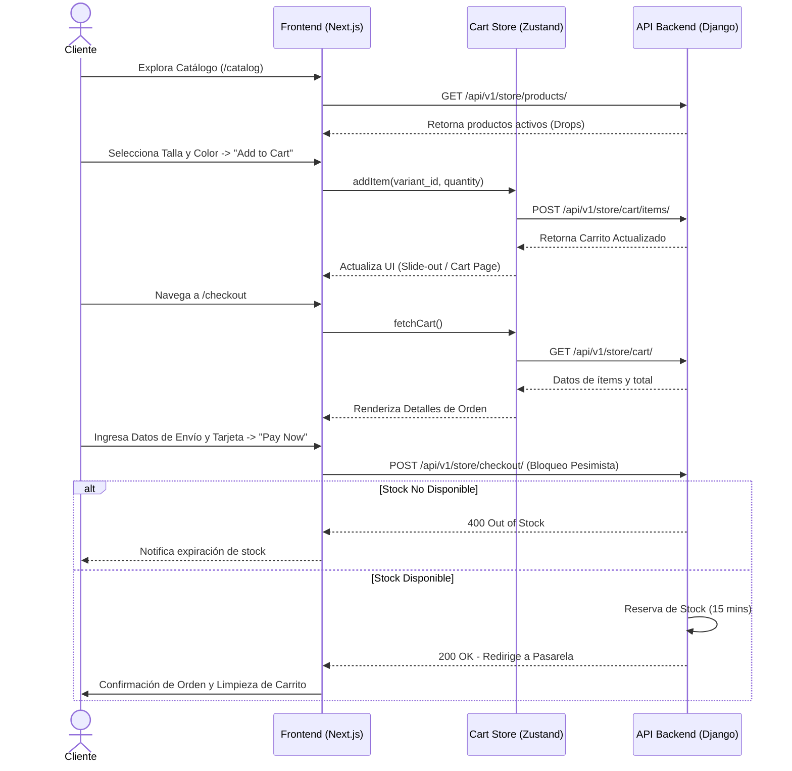

# Diagrama de Flujo - Shepherd Garde

A continuación se presentan los flujos principales de la aplicación para la demostración del proyecto.

## 1. Flujo de Registro y Autenticación (Demo)

Este flujo demuestra cómo un usuario se registra en la plataforma y cómo la información es validada y guardada en el backend.

## 2. Flujo de Compra y Carrito (Checkout)

Flujo regular de un cliente que explora los drops temporales, añade al carrito y procesa el pago.

